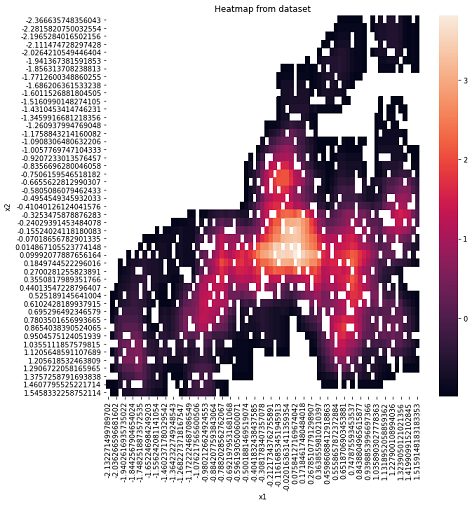
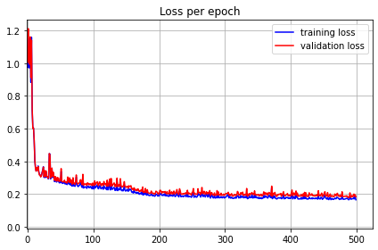
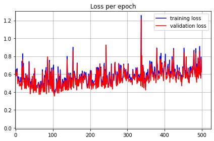
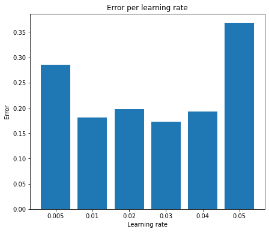
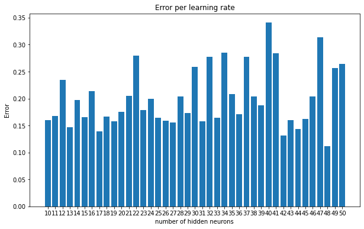
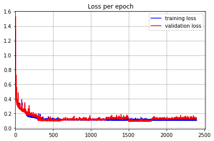
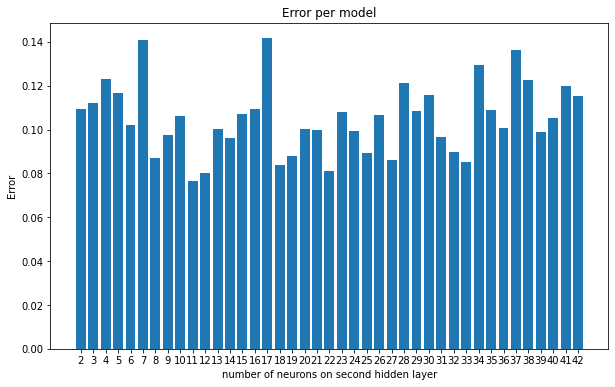
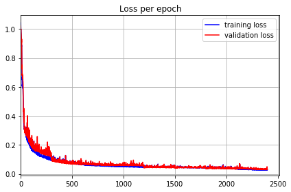
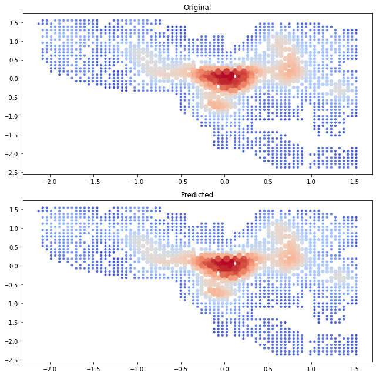

https://github.com/TheKompot/NeuralNetwork
---
# NeuralNetwork

## Dataset

* 1771 riadkov
* 3 stlpce : 2 vstupy 1 vystup
* interval vstupu od -2.5 do 1.6
* interval vystupu od -1 do 3.9

### Vizualizacia dat

## Tvorba modelu
Zo zaciatku sme pouzili model, ktory mal:
* 3 vrstvy
* 10 neuronov na skrytej vrstve
* learning rate 0.1
* aktivacnu funkciu sigmoid na vsetkych vrstvach okrem vystupnej (kedze vystup je z nestandartneho intervalu)
* prvotne nahodne vahy z rovnomerneho rozdelenie s intervalom -0.3 az 0.3

Trenovali sme:
* 500 epochami
* bez k-fold crossvalidation

Chyba takehoto modelu bola cca 0.6

### Ine aktivacne funkcie

Vyskusali sme aktivacne funkcie: sigmoid, tanh a relu. Avsak najlepsia bola funkcia sa ukazala **sigmoid**, tanh z nejakeho dovodu nefugoval (niesom si isty preco)
#### Sigmoid graf

#### ReLU graf

### Learning rate

Testovali sme learning rate z intervalu 0.05 az 0.5, zistili sme ze najlepsia hodnota bola 0.05 a tak sme sa pozreli na interval 0.005 az 0.05. Kde sa ukazala hodnota okolo **0.03** najlepsia

### Pocet neuronov na skrytej vrstve

Rovnako ako pri learning rate, sme zistovali pre rozne hodnoty konecnu chybu. Skusali sme okolo 100 hodnot, najlepsia sa ukazala hodnota **48**. 
Vystupny graf podla ktoreho sme sa rozhodli:

### K-fold crossvaidation

Uz vela parametrov neostavalo, tak sme skusali rozne metody trenovania ako k-fold crossvalidation, s roznymi k hodnotami. Pri **k rovne 8** sme nasli najlepsi vysledok. Kedze ale uz trenovanie trvalo pomerne dlho znizili sme pocet **epoch na 300**. Chyba takejto siete bola cca **0.1**.

### Stvrta vrstva

Kedze sme stale mali chybu mierne vyssiu ako 0.1, tak sme chceli experimentovat s viacerymi vrstvami. Vytvorili sme 40 stvor-vrstvovych modelov, z intervalu 2 az 42 a zistili ich presnost. Najlepsi sa zdal model s **11 neuronmi** na druehej skrytej vrstve.

## Novy model

Pre model sme vybrali nasledovne parametre:
* 4 vrstvy
* 48 neuronov na prvej skrytej vrstve
* 11 neuronov na druhej skrytej vrstve
* learning rate 0.03
* aktivacnu funkciu sigmoid na vsetkych vrstvach okrem vystupnej
* prvotne nahodne vahy z rovnomerneho rozdelenie s intervalom -0.3 az 0.3

Trenovali sme:
* s 300 epochami
* s pouzitim k-fold crossvalidation s k=8

Takyto model mal chybu rovnu cca **0.02**

Jeho vahy su ulozene v subore weights.npy

## Poznamky pre cviciacich
* Je pre Vas pripraveny python skript s nazvom 'pre_cviciacich.py', kde by malo byt pre Vas lahke otestovat model na vasich datach
* Trenovanie s k-fold crossvalidation trvalo u mna 10 minut, ak je to pridlho tak obycajne trenovanie trvalo nieco malo cez minutu a potom mal model chybu cca **0.07**